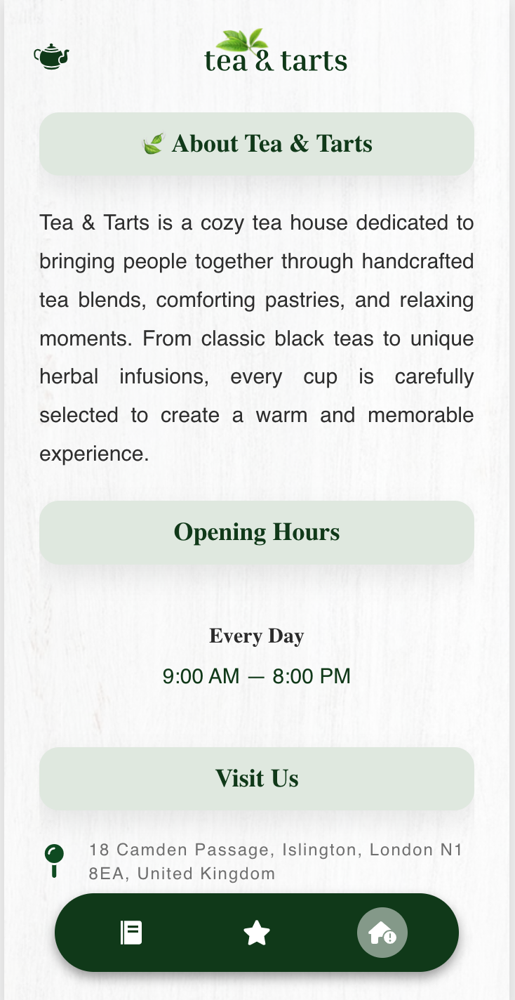
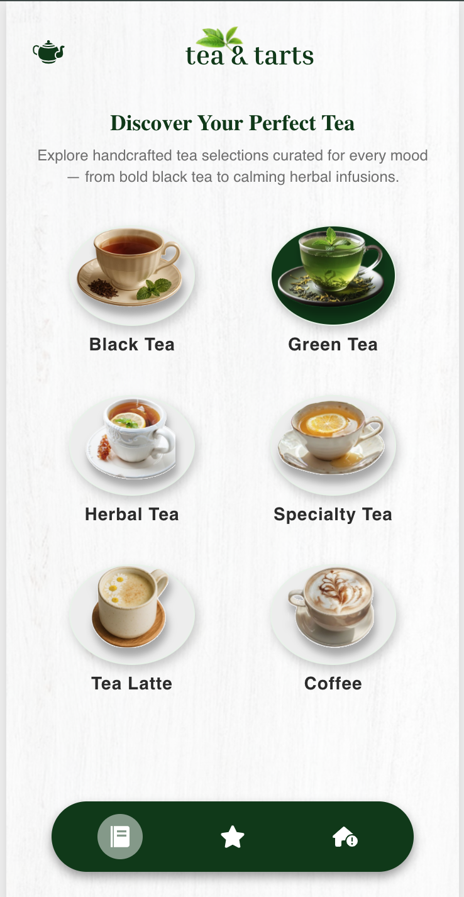
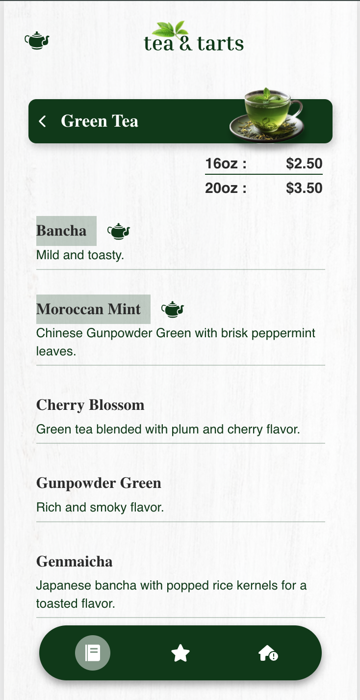
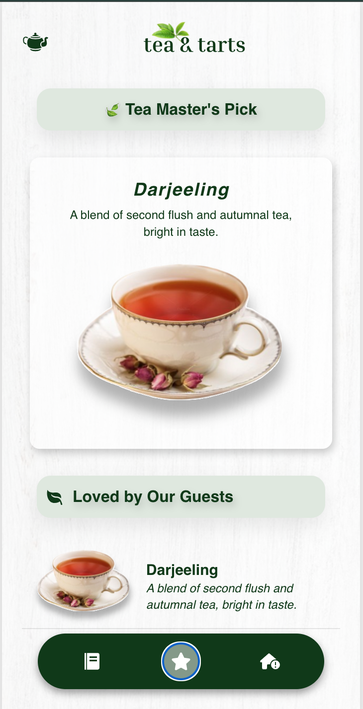
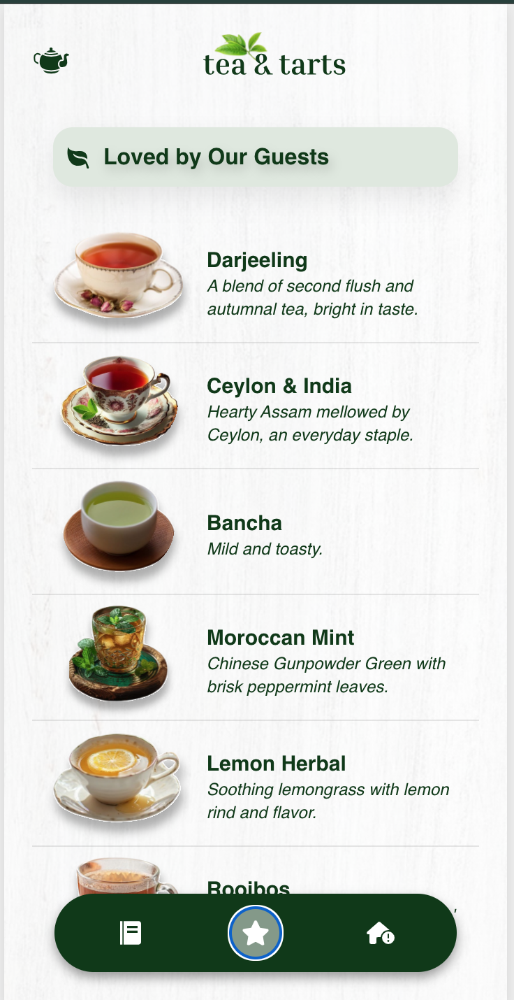

# Douce Delice Bakeries

A modern digital tea menu built with React, designed to provide customers with a smooth and elegant browsing experience for exploring handcrafted tea selections.

## ✨ Features

### 📖 Interactive Menu

Browse tea categories including:

* Black Tea
* Green Tea
* Herbal Tea
* Specialty Tea
* Tea Latte
* Coffee

### 🌟 Tea Recommendations

Discover curated selections such as:

* Tea Master's Pick
* Loved by Our Guests
* More Chef Recommendations

### 🏡 About Page

Learn more about Tea & Tarts including:

* Store information
* Opening hours
* Location
* Map preview

### 🎨 Smooth User Experience

* Mobile-first design
* Animated page transitions using Framer Motion and AOS
* Bottom navigation menu
* Category-based menu filtering
* Dynamic menu rendering from JSON data

---

## 🛠️ Tech Stack

### Frontend

* React.js
* React Router DOM
* Framer Motion
* React Icons
* AOS

### Data Management

* JSON-based menu structure

### Styling

* CSS3
* Responsive Mobile Layout

---

## 📂 Project Structure

src/

├── Assets/

│ ├── Recommendation/

│ ├── cat1.png

│ ├── cat2.svg

│ └── ...

│

├── Components/

│ ├── Navbar.jsx

│ ├── MenuNavbar.jsx

│ └── NavigasiBottom.jsx

│

├── Data/

│ └── TeaMenu.json

│

├── Pages/

│ ├── MenuPage.jsx

│ ├── ListMenu.jsx

│ ├── Recommendation.jsx

│ ├── AboutPage.jsx

│ └── MenuList.jsx

│ └── Welcome.jsx


│

├── Styles/

│ ├── Components/

│ ├── Tea/

│ └── ...


│

├── Utils/

│ ├── AosInit.jsx/

│


├── App.js

└── index.js


---

## 🚀 Getting Started

Clone the repository:

```bash
git clone https://github.com/your-username/tea-and-tarts.git
```

Install dependencies:

```bash
npm install
```

Run development server:

```bash
npm start
```

Build production version:

```bash
npm run build
```

---

## 🎯 Project Goal

This project was created as a portfolio piece to demonstrate:

* React component architecture
* Dynamic data rendering
* JSON-based content management
* Mobile-first UI design
* Interactive menu experiences for cafés and restaurants

---

## 📸 Preview

Tea & Tarts provides a calm, elegant, and user-friendly experience inspired by modern tea houses and digital café menus.







## LIVE PREVIRW / Deploy link 
[https://real-standard-package.vercel.app]


